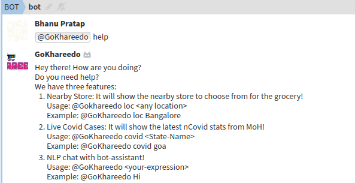
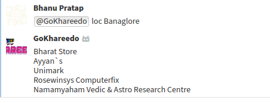
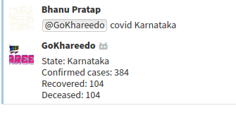
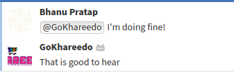
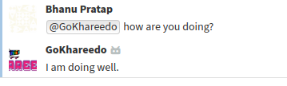
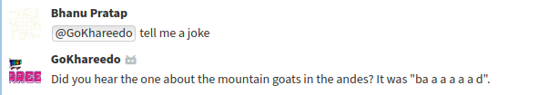

# GoKhareedo Assistant Bot


This repository contains the source code for GoKhareedo Assistant Bot

The source code is written in [Python 3](https://www.python.org/).

This bot is made using [Zulip](https://zulipchat.com/api) and is a submission for the API prize!

You can find Zulip Python Client [Here](https://github.com/zulip/python-zulip-api)

## Features of the bot
1. Nearby Stores:
It uses Google Maps API to search for nearby stores from your specified location! It helps you choose the store before you leave your house!
2. StateWise Live Covid Stats: It shows you the state-wise live stats of the covid cases from [MoH](https://www.mohfw.gov.in/). It's using WebScaping to scrape the data from the website. And send you the data of state you specify in input!
3. NLP chat: It uses Natural Language processing to chat with you like human assistant!

## Instructions
- Clone the repo to your local system:

    ```
    git clone https://github.com/ibhanu/zulip-bot.git
    ```
- Change the directory to zulip-bot folder:

    ```
    cd zulip-bot
    ```
    
- Create a Python Virtual Environment for the project to avoid pip collision

    - [**NOTE**] If you don't have Virtual Environment Package install it by running following command:
    
        ```
        pip install virtualenv
      ```
    
    - Create your Virtual Environment using the following command:
    
        ```
        python3 -m venv env
      ```
        
    - Activate your Virtual Environment using following command:
    
        ```
        source env/bin/activate
      ```
        
- Install the Required Libraries for the project by excuting following command:

    ```
    pip install -r req.txt
  ```
    
- [Create a Zulip Realm](https://zulipchat.com/api/running-bots) 
    - Goto to settings and create a new generic bot named 'GoKhareedo'. (Settings can be found in dropdown of gear icon present in top right corner of zulip realm)
    - Download the zuliprc file for your bot and place it in your home directory as '.zuliprc'.

- In file storeloc.py change the YOUR-API-KEY to your [Google Maps API](https://cloud.google.com/maps-platform) key with Places and Geocoding enabled!    

- In bot.py , change site in 
    ```
    self.client = zulip.Client(site="https://GoKhareedo.zulipchat.com/api/")
    ```
   to url of your created zulip realm.
 
    Do the same for BOT_MAIL variable.
 
    - Run bot.py using python 3.:
        ```
        python bot.py
        ```

## Usage
 - Help or Usage: 
 
    
    
 - Nearby Store Locator:
 
    
 
 - State-Wise Live Covid Stats:
 
    
    
 - NLP Chat with the bot:
    
    
    
    
    
    
    
    
    
    
    
## Contributer
- [Bhanu Pratap](https://bhanupratap.me)
- [Abhay RM](https://abhayrm.com)
- [Mayukh Sil](https://instagram.com/bantai.bombil)

### A Project by Team [NullCrew](https://instagram.com/nullcrewofficial)


    
    
    

